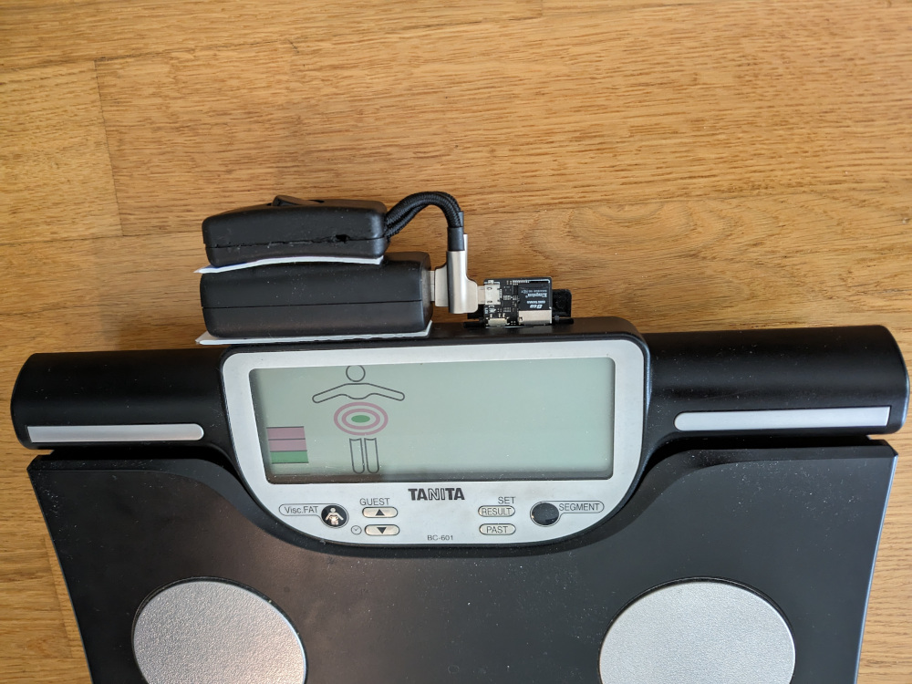

> [!WARNING]  
> Disclaimer: I threw this together on a weekend without prior Arduino experience. It's not clean and most likely contains bugs, so proceed with caution.

# Auto-post files from FYSETC's SD-WIFI module to an HTTP(S) endpoint

## About this fork

This is a fork of the firmware for the FYSETC SD-WIFI module ([aliexpress.com/item/4001095471107.html](https://www.aliexpress.com/item/4001095471107.html)). Instead of spinning up a WebDAV server, this fork proactively posts a file to an HTTP(S) endpoint.

It has two modes of operation:

1. Post the file every X seconds.
2. Post the file every time after the other SD-card host uses (and frees up) the bus.

Other features include:

* HTTPS support
* Battery-efficient: stop POST-requests after a defined number of requests, or when the bus has not been used by the other host for 2 minutes (whichever comes first).
* Send tail of file only: only send last x bytes of a file to support large append-only files.

## Usage

### Installation

Flash one of the binaries from the "releases" section using [esptool.py](https://docs.espressif.com/projects/esptool/en/latest/esp8266/esptool/flashing-firmware.html).

### Configuration

This firmware reads its configuration from a file called `espconfig.json` in the root of the SD-card.

The configuration should be in the following format:
```
{
  "wifiSsid": "<Wifi SSID>",
  "wifiPassword": "<Wifi Password>",
  "filePath": "<Path to file that should be posted>",
  "fileTailBytes": <How many bytes of the end of the file to post. 0 to disable>,
  "endpointUrl": "<Endpoint URL to post to>",
  "endpointAuthorization": "<Authorization header to attach to POST request>",
  "postIntervalSeconds": "<Seconds to wait between POST requests. 0 to post after other Sd host frees up the bus>",
  "postNumberBeforeShutdown": "<Number of POST requests to send before going to sleep>"
}
```

Example:
```
{
  "wifiSsid": "Wifi",
  "wifiPassword": "ReplaceMe",
  "filePath": "TANITA/GRAPHV1/DATA/DATA1.CSV",
  "fileTailBytes": 5120,
  "endpointUrl": "https://<your-endpoint>",
  "endpointAuthorization": "Basic ABCDEF",
  "postIntervalSeconds": -1,
  "postNumberBeforeShutdown": 6
}
```

### LED
The LED serves two purposes: to understand roughly which state the FYSETC SD-WIFI is currently in and to distingish different (terminal) error states.

#### Successful operation
1. Power on: LED off
2. While waiting for the other host to free the bus to read config: LED continuously on
3. Reading config: LED off
4. Connecting to WiFi: LED blinks fast (300ms)
5. Optional: If waiting for other host to access and free bus: LED continuously on
6. While succesfully posting data: LED off
7. (5) and (6) repeat until the FYSETC SD-WIFI goes to sleep.

#### Error states
If anything goes wrong, the FYSETC SD-WIFI indicates this with a number of short LED blinks, followed by a long pause (repeated infinitely). Depending on the number of blinks, we can tell which stage the FYSETC SD-WIFI failed in:

* 1 blink: Failed right after boot
* 2 blinks: Failed initializing the SD
* 3 blinks: Failed to load config (either because the file doesn't exist or because it is formatted incorrectly / fields are missing / fields can't be parsed)
* 4 blinks: Failed to connect to Wifi
* 5 blinks: File to post not found
* 6 blinks: HTTP endpoint returned a non-2xx result code.

## Original use-case: internet-connectivity for Tanita BC-601 scale

The original/intended use case for this fork is to automatically sync measurement data from a [Tanita BC-601 segmental body composition scale](https://tanita.co.uk/bc-601). It already logs measurements to an SD-card. This fork enables live tracking of the measurement's online (e.g. on a dashboard).

### Limitations

* The scale is battery-powered, and does not supply enough power through it's SD-card slot to drive the ESP. To use this fork on the Tanita BC-601, the FYSETC SD-WIFI needs an external power supply (since FYSETC SD-WIFI uses micro-usb, a standard phone charger or powerbank does the job).
* A restart/power-cycle of the scale while FYSETC SD-WIFI is running isn't possible. More specifically: after FYSETC SD-WIFI is powered-on, the scale starts correctly, and can take repeated measurements as long as it remains powered-on. If the scale fully powers off, every subsequent boot (while FYSETC SD-WIFI is still running) triggers an error message on the scale. I did not have time to fully debug this, and instead opted to simply add a switch to power cycle FYSETC SD-WIFI together with the scale.



## Building

### Dependencies

1. [ESP8266 Arduino Core version 2.7.4](https://github.com/esp8266/Arduino)
2. [SdFat library 2.2.2](https://github.com/greiman/SdFat)
3. [Arduino_JSON 0.2.0](https://github.com/arduino-libraries/Arduino_JSON)

### Compile and upload

Install dependencies in Arduino IDE (tested with 2.3.2), then follow "Compile and upload" instructions on [FYSETC/ESPWebDAV](https://github.com/oogm/SdWifiHttpAutopost?tab=readme-ov-file#compile-and-upload).


